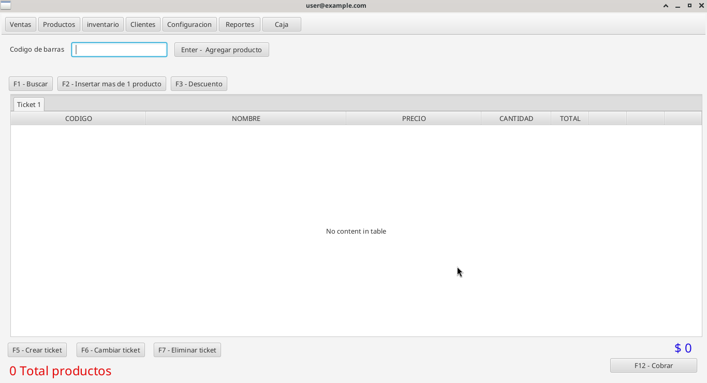
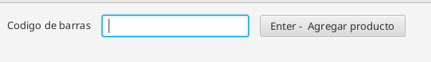
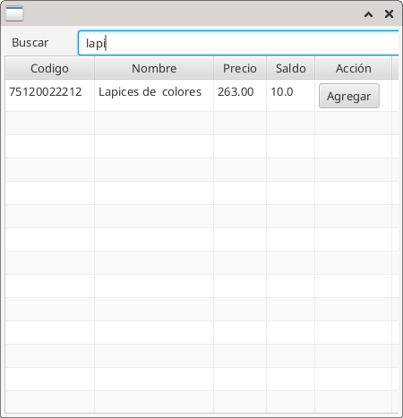
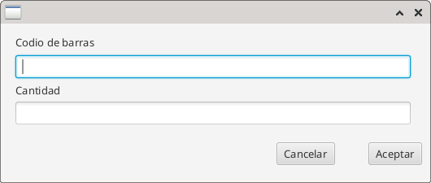
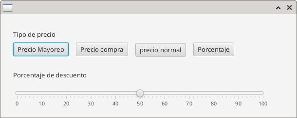

<h1>Punto de venta para tienda de abarrotes o similares</h1>

Este software de punto de venta ofrece una solución integral para la gestión de su negocio. Permite registrar ventas, aplicar descuentos y administrar departamentos. También facilita la creación, modificación y venta de productos, incluyendo la opción de venderlos en paquetes.

El sistema de inventario gestiona de forma precisa las entradas y salidas de productos, permitiendo además filtrar los registros por fechas y departamentos.

En el área de reportes, podrá consultar información detallada sobre ventas, ingresos, egresos y un informe completo del negocio.

El módulo de cajas permite registrar tanto ingresos como egresos, brindando un control eficiente de los movimientos financieros.

Además, el módulo de reparaciones le permite crear, listar y modificar órdenes de reparación, proporcionando un resumen claro de las ganancias con filtros por fechas para una mejor visualización de los resultados.

Este es la parte del front end, desarrollada con Java FX 

La parte del backed esta desarrolla con nestJS utilizando postgresql como base de datos 

version jdk: 17 

<h3> Login</h3>

El usuario por defecto es usuario: Administrador y contraseña: <strong> Admin123* </strong> 
 

**Ventana de inicio modulo de ventas**

El objetivo principal del modulo de ventas es poder registrar las mismas.  
Principales funciones del modulo de ventas
- **Enter** Insetar producto al ticket.
- **F1** Buscar un producto.
- **F2** Insertar mas de un producto.
- **F3** Aplicar descuento.
- **F5** Crear ticket.
- **F6** Cambiar ticket.
- **F7** Eliminar ticket.

Para insertar un producto al ticket, capture el codigo de barras manualmente  y despues pulse enter, o puede leer el codigo de barras con un lector de codigo de barras.

Para buscar un producto presione **F1** se abrira un modal y tendra un input donde podra escribir el nombre del producto, una vez encontrado presione en el boton agregar.

Insertar mas de un producto presione **F2** se abre un modal capture el codigo de barras y la cantidad a vender.

Aplicar descuento presion **F3**, hay diferentes tipos de descuentos selecciones el de su preferencia.

