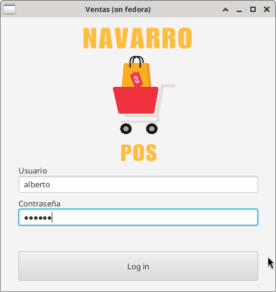

<h1>Punto de venta para tienda de abarrotes o similares</h1>

Este es la parte del front end, desarrollada con Java FX 

La parte del backed esta desarrolla con nestJS utilizando postgresql como base de datos 

version jdk: 17 

<h3> Login</h3>

